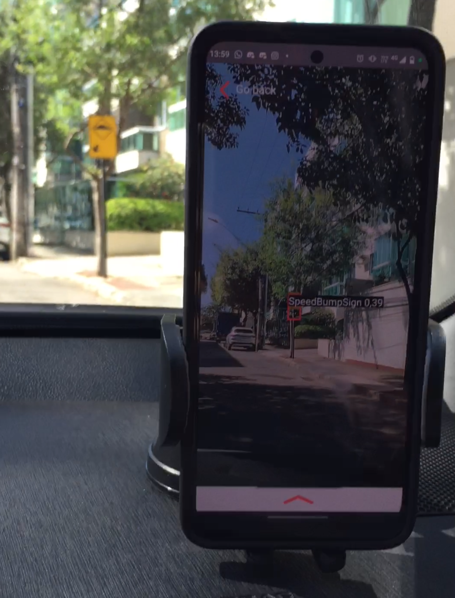

# Speedbump Detector

This is a neural network envisioned to detect speedbumps signs, hosted in a smartphone environment with restrained resources.

## Demonstration

<table>
<tr>
<td></td>
<td></td>
</tr>
<tr>
<td>Earlier versions of the app</td>
<td>More recent results</td>
</tr>
</table>

Using the Tensorflow Lite library to train the model, it was possible to generate a real-time response for the speed bump on the streets, to better alert the driver. A video demonstration is presented below:

[](https://youtu.be/RBKqtdzmBTY)


## Dataset

### Image backgrounds

The dataset is built merging templates and COCO (Common Objects in Context) images on these topics:

- 600 images on `dog`
- 600 images on `cat`
- 600 images on `bird`
- 600 images on `banana`
- 600 images on `sandwich`
- 600 images on `carrot`
- 600 images on `orange`
- 600 images on `apple`
- 600 images on `pizza`
- 600 images on `hot dog`
- 600 images on `donut`
- 600 images on `cake`
- 600 images on `chair`
- 600 images on `dining table`
- 600 images on `toilet`
- 600 images on `bed`
- 600 images on `couch`

> [Instructions on how to use the script on COCO](/script_coco/COCO_GETTING_STARTED.md)

In order to use the COCO images, is necessary to pre filter them, with scaling to fit a dimension bound. The current bound is set to 640 pixels minimum on both dimensions. Images too tiny get discarted.

> [More info about filter process](/dataset_mobile/FILTER.md)

In total, were used more than 44.200 COCO images which got narrowed down to 44.100 after filtering. That produced 40.000 samples for training.

From those, 32.000 were train samples, 4.000 test samples and 4.000 validation samples.

### Templates

The template images where acquired via public access, from CONTRAN (Conselho Nacional de Trânsito) database available below:

- ["Sinalização Vertical de Regulamentação"](https://www.gov.br/infraestrutura/pt-br/assuntos/transito/arquivos-senatran/docs/copy_of___01___MBST_Vol._I___Sin._Vert._Regulamentacao_F.pdf)
- ["Sinalização Vertical de Advertência"](https://www.gov.br/infraestrutura/pt-br/assuntos/transito/arquivos-senatran/docs/copy_of___02___MBST_Vol._II___Sin._Vert._Advertencia.pdf)
- ["Sinalização Vertical de Indicação"](https://www.gov.br/infraestrutura/pt-br/assuntos/transito/arquivos-senatran/docs/copy_of___03___MBST_Vol._III___Sin._Vert._Indicacao.pdf)

Also:

- ["Sinalização Brasileira"](https://pt.wikipedia.org/wiki/Sinaliza%C3%A7%C3%A3o_de_tr%C3%A2nsito_no_Brasil)

#### Speed bump sign

- Dimensions: 70x70 pixels
- Color: yellow/orange
- Shape: rectangle/diamond
- File: ppm (Portable Pixmap Format)
- Amount: 16 files

#### Other types of signs

- Dimensions: 70x70 pixels
- Color: vary
- Shape: vary
- File: ppm (Portable Pixmap Format)
- Amount: 119 files

A total of 16 templates from speed bumps where used for this dataset creation, alogside the other types of signs, it sum up to 134 different templates.

### Generating overlapped images for training

In order to generate dataset, its necessary to check if bgs (targets) and templates are OK to go. Specify the paths for these two and for the output, alogside the number of samples with the command:

```bash
python3 generate_dataset.py --bgs-path <path> --templates-path <path> --out-path <path> --total-images <number>

#ex:
python3 generate_dataset.py --bgs-path bgs --templates-path templates --out-path output --total-images 1500
```

Due to the random positioning of templates, it may take a while to generate all the samples.

### Split dataset onto train, test and validation

A module built for splitting the recent generated dataset is available on `split_dataset.py`, where must be setted the speed bump sign threshold (last specific sb sign ppm file, to separate from other signs), train amount, test amount and validation test amount. These last three must be provided in percentage (decimal).

```py
SPEED_BUMP_THRESHOLD=15 # last sb sign is 0015.ppm
TRAIN_AMOUNT=.8         # 80%
TEST_AMOUNT=.1          # 10%
VAL_AMOUNT=.1           # 10%
```

A full log of result quantities is displayed on console.

## Mobile Tensorflow Lite

> [Tensorflow Lite 2 colab](https://colab.research.google.com/drive/1D2elywD2a8bsWZPGSxYv3RZKiP_h1jLR#scrollTo=Gb7qyhNL1yWt) for GPU access to train the model

The tensors of the trained model are described in [here](tensors_details_10k_model.py).

## Metrics

- Samples: 10.000
- Epochs: 50
- Batch size: 8
- AP (Average Precision): 0.908 (90.8%)
- Average training session: 3.5h

## Dataset layout

```
TRAINING,gs://cloud-ml-data/img/openimage/3/2520/3916261642_0a504acd60_o.jpg,Salad,0.0,0.0954,,,0.977,0.957,,
```

```
VALIDATION,gs://cloud-ml-data/img/openimage/3/2520/3916261642_0a504acd60_o.jpg,Seafood,0.0154,0.1538,,,1.0,0.802,,
```

```
TEST,gs://cloud-ml-data/img/openimage/3/2520/3916261642_0a504acd60_o.jpg,Tomato,0.0,0.655,,,0.231,0.839,,
```

## Speedbump dataset layout

```
TRAINING,imgs/00000_COCO_train2014_000000262260.jpg,SpeedBumpSign,0.4375,0.1007,,,0.5453,0.2623,,
```

```
TEST,imgs/00148_COCO_train2014_000000524366.jpg,SpeedBumpSign,0.6531,0.0000,,,0.7844,0.1944,,
```

```
VALIDATION,imgs/00149_COCO_train2014_000000114776.jpg,SpeedBumpSign,0.6813,0.3167,,,0.7516,0.4104,,
```

## Exporting to mobile environment

Once the model is trained, is necessary to upload the `.tflite` file into the android studio project at this directory:

```
/mobile-app-tensorflow/examples/lite/examples/object_detection/android/app/src/main/assets
```

The model file must be named `mobilenetv1.tflite` in order to match the ML engine used.


### Acknowledgement

Credits to [@tabelini](https://github.com/lucastabelini) for providing the [dataset generation script](https://github.com/LCAD-UFES/publications-tabelini-ijcnn-2019), which got adapted for this project. 